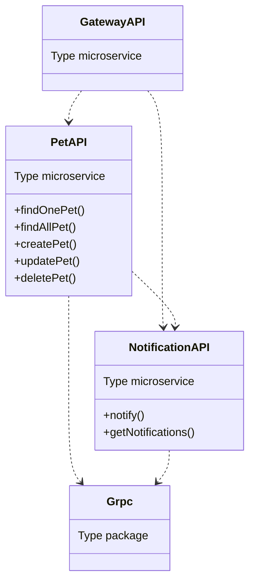

# NestJS Microservices with GRPC <!-- omit in toc -->

[NestJS](https://nestjs.com/) is a modern Typescript-based framework for building efficient, scalable Node.js server-side applications. As a microservices is trending nowadays, and [Monorepo](https://monorepo.tools/) is a great way to manage multiple projects with a great code sharing, NestJS provides a great way to build microservices with [GRPC](https://grpc.io/). This repository is a simple example of how to build microservices with NestJS and GRPC on the Monorepo model.

# Table of Contents <!-- omit in toc -->

- [Architecture](#architecture)
  - [Applications](#applications)
  - [Internal Packages](#internal-packages)
- [Tools](#tools)
- [What is microservices](#what-is-microservices)
  - [Service Decomposition](#service-decomposition)
  - [API Composition](#api-composition)
  - [Sharing gRPC codegen](#sharing-grpc-codegen)
- [Pre-requisites](#pre-requisites)
- [Local Development](#local-development)
- [References](#references)

# Architecture



## Applications

- [Gateway API](./apps/gateway-api/) is the entry point of the application. It is responsible for handling the requests from the client and forwarding them to the appropriate microservice.
- [Pet API](./apps/pet-api/) is responsible for handling the requests related to the pet.
- [Notification API](./apps/notification-api/) is responsible for handling the requests related to the notification.

## Internal Packages

- [grpc](./libs/grpc/) is a package that contains the common GRPC files. Most of all the files are generated by [ts-proto](https://github.com/stephenh/ts-proto)

# Tools

- [NestJS](https://nestjs.com/) - A Node.js framework for creating efficient, scalable, and enterprise-grade server-side applications.
- [GRPC](https://grpc.io/) - A internal RPC communication protocol.
- [ts-proto](https://github.com/stephenh/ts-proto) - A Typescript code generator for Protocol Buffers.
- [Turborepo](https://turborepo.com/) - A monorepo tool that helps you to manage multiple projects.

# What is microservices

[Microservices](https://microservices.io/) are an architectural approach to software development which is composed of small self-contained services. Each service is mostly independent of other services. This approach allows us to deliver software rapidly, reliaby, frequently, and efficiently.

The tradditional way to build software is to use monolithic architecture. But, as the software grows, it becomes difficult to maintain and scale. So, microservices is a great way to solve this problem.

## Service Decomposition

The first step to build microservices is how do we split the services. There are many ways to do. I suggest you to read [Microservice Patterns](https://microservices.io/patterns/index.html), especially **Decomposition** section.

> Since this is a simple example of microservices. This repo does not represent how to decompose the services.

## API Composition

You may end up with multiple application that responsible for specific domain. To keep client-side application be able to communicate with all the services, we need to compose the API. This is where [Gateway API](./apps/gateway-api/) comes in. It is responsible for handling the requests from the client and forwarding them to the appropriate microservice as a [REST API](https://www.techtarget.com/searchapparchitecture/definition/RESTful-API).

## Sharing gRPC codegen

[Protocol Buffers](https://protobuf.dev/) is a language-neutral, platform-neutral, extensible mechanism for serializing structured data. It is a great way to define the data structure.

[gRPC](https://grpc.io/) is a open source RPC framework that works with Protocol Buffers. It is a great way to communicate between services. gRPC can works with many languages, including [Node.js](https://nodejs.org/en). [ts-proto](https://github.com/stephenh/ts-proto) is a Typescript code generator for Protocol Buffers. It is a great way to generate the code for gRPC.

The traditional way to share the Protobuf codegen is to use [Git Submodule](https://git-scm.com/book/en/v2/Git-Tools-Submodules). But, it is not a good way to manage the codegen.

In the modern era, I suggest you to use [Monorepo](https://monorepo.tools/) to manage them.

# Pre-requisites

- [Node.js](https://nodejs.org/en) - v16+
- [Yarn](https://yarnpkg.com/) - v1.22+
- [buf](https://github.com/bufbuild/buf) - A new way to manage Protocol Buffers

# Local Development

1. Clone the repository

   ```bash
   git clone git@github.com:saenyakorn/nestjs-microservices.git
   ```

2. Install the dependencies

   ```bash
   yarn
   ```

3. Generate the codegen

   ```bash
   yarn codegen
   ```

   > This command will generate the codegen for all the services that has **codegen** command in package.json.

4. Start all services in development mode

   ```bash
   yarn dev
   ```

   The application will be available at the following URLs:
   | Service | URL |
   | ---------------- | --------------------- |
   | Gateway API | http://localhost:4000 |
   | Pet API | http://localhost:4001 |
   | Notification API | http://localhost:4002 |

   > OpenAPI documentation is available at http://localhost:4000/docs

5. Try to call the simple API

   ```bash
   curl -X GET "http://localhost:4000/pets" -H "accept: application/json"
   ```

# References

- [ts-proto with NestJS](https://github.com/stephenh/ts-proto/blob/main/NESTJS.markdown)
- [NestJS gRPC](https://docs.nestjs.com/microservices/grpc)
- [Microservices Concept](https://microservices.io/)
